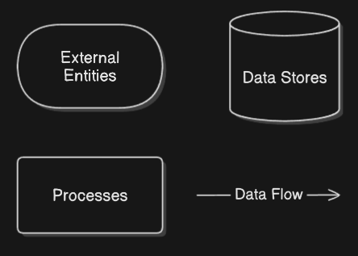
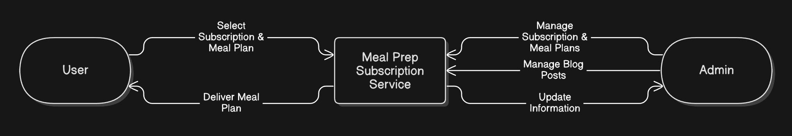
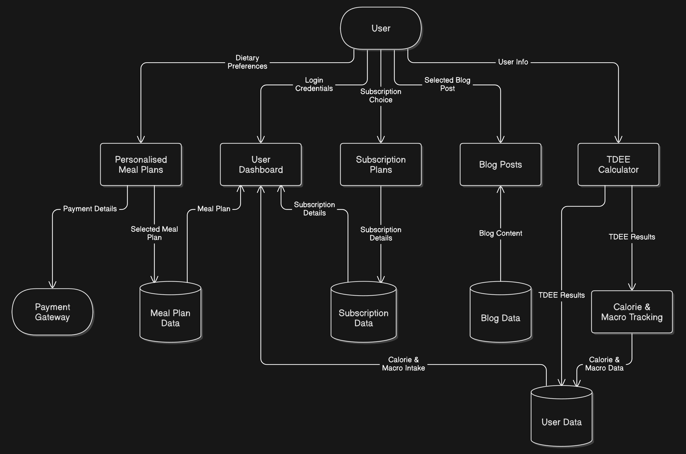
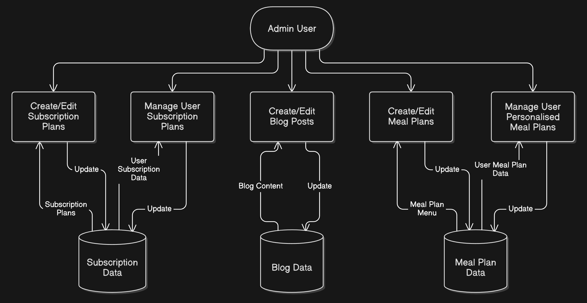
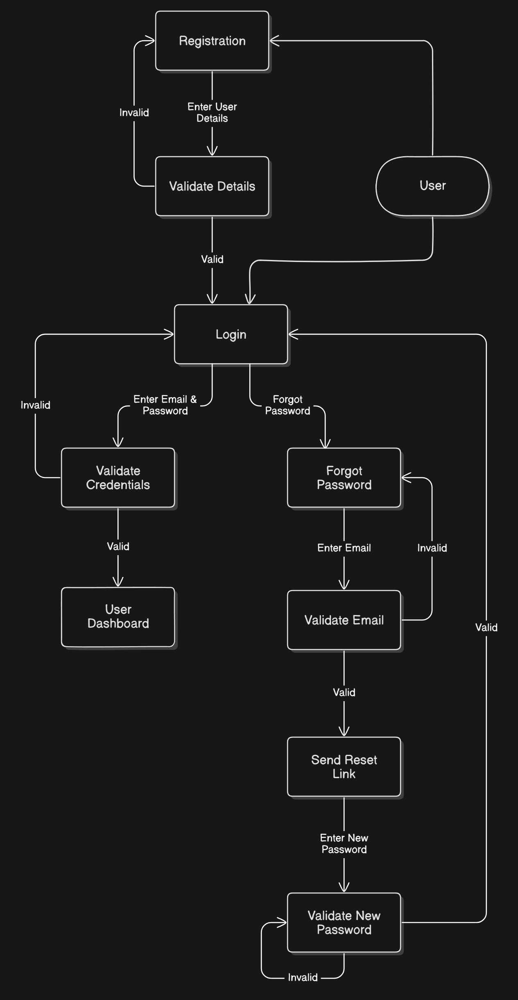
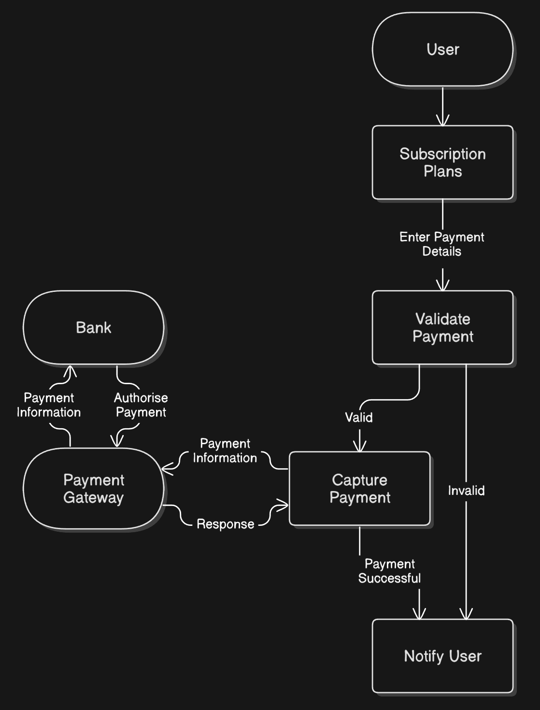
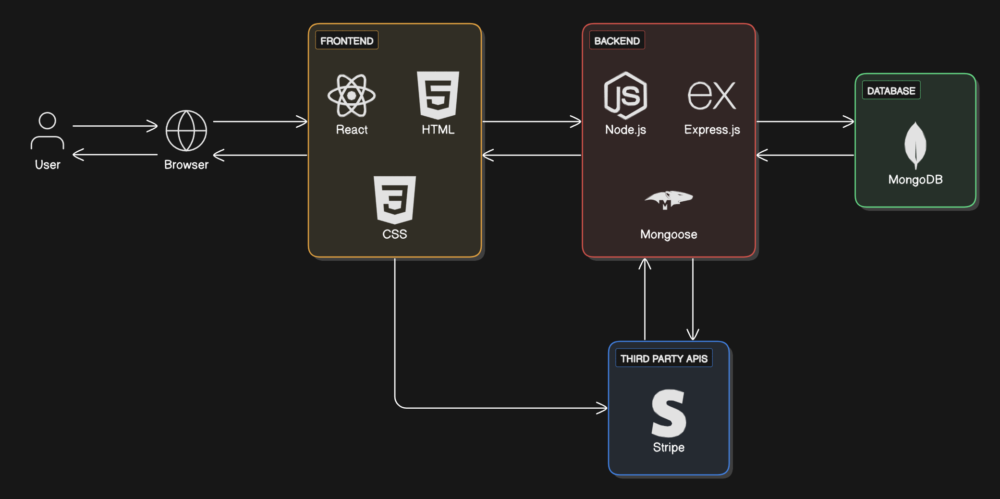
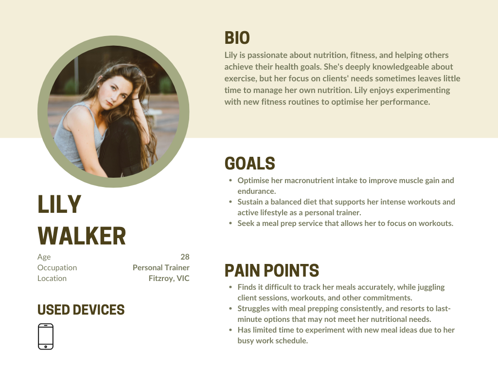
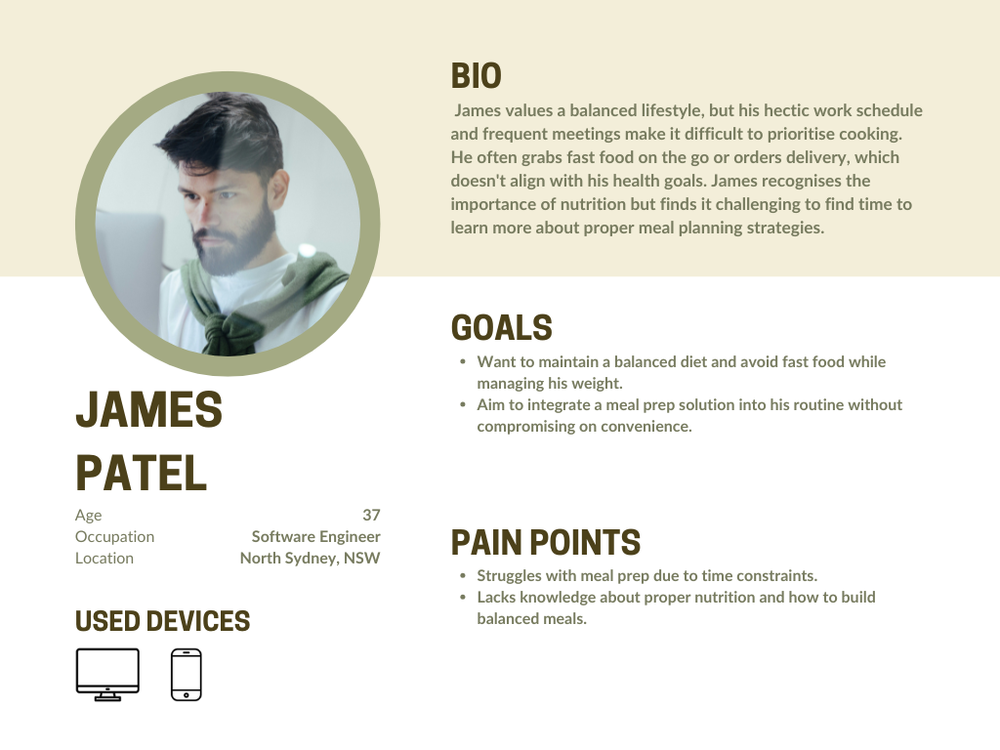
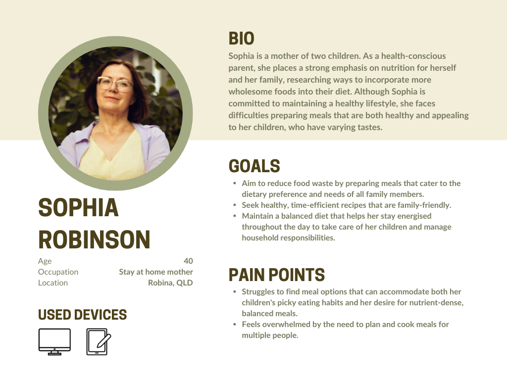

# PlateTonic T3A2-A

### Contributors

Van Nguyen - [GitHub](https://github.com/montsieur)

Veronica Chung - [GitHub](https://github.com/chung-v)

# R1 Description of your website, including purpose, functionality / features, target audience and tech stack

## Purpose

Plate Tonic is an innovative meal prep service designed to help individuals manage their weight effectively. It offers calorie and macronutrient tracking, personalised meal plans, and educational resources to support weight loss, maintenance, or muscle gain.

## Functionality / Features

### TDEE Calculator

Calculates daily calorie and macronutrient needs based on activity level and fitness goals.

### Calorie and Macronutrient Tracking

Monitors calorie and macronutrient intake to ensure users stay on track with their fitness objectives.

### Personalised Meal Plans

Allows users to input their dietary preferences and goals to receive customised meal plans.

### Subscription Models

Offers flexible weekly and monthly subscription plans for meal deliveries.

### Educational Content

Provides blogs, recipes, and tips to promote healthy eating habits.

## Target Audience

- Individuals aiming to lose weight, maintain their current weight, or gain muscle.
- Health-conscious individuals who prefer the convenience of meal prep.
- Fitness enthusiasts tracking their calorie and macronutrient intake.

## Tech Stack

### Frontend

- HTML
- CSS
- React

### Backend

- Node.js
- Express.js

### Database

- MongoDB

### Authentication

- JWT for user login and subscriptions

### Hosting

- Netlify for frontend
- Render for backend

# R2 Dataflow Diagrams

## Legend

## Level 0 - Context Diagram

## Level 1 - Main Processes

### General User Dataflow Diagram

### Admin User Dataflow Diagram

## Level 2 - Sub-Processes

### User Registration and Login Dataflow Diagram

### Subscription Payment Dataflow Diagram

# R3 Application Architecture Diagram

## Frontend

Built with HTML, CSS, and React, the frontend creates the user interface and fetches data from the backend via API requests. It dynamically updates the UI based on user interactions and API responses. The frontend will be deployed via Netlify.

### HTML and CSS

HTML provides the structure of web pages. CSS is used for styling, layout, and responsiveness.

### React

React manages the dynamic components:
- **Registration and login**.
- **User dashboard** - Displays user data, meal plans, and subscription details.
- **TDEE calculator and calorie/macronutrient tracker** - Tracks calorie and macronutrient intake.
- **Meal plan menu** - Displays available meal plans.
- **Subscription plan menu** - Handles plan selection and management.
- **Blog posts** - Displays health and nutrition articles.

## Backend

Built using Node.js and Express.js, the backend handles business logic, data processing, authentication, and API routing. It utilises middleware for logging, error handling, and request validation, while environment variables manage configurations for scalability. The backend will be deployed via Render.

### Node.js and Express.js

Key components include:
- **Authentication service** - Manages user login and registration using JWT authentication.
- Calorie and macronutrient tracker - Monitors and stores user calorie and macronutrient intake.
- **Meal plan service** - Fetches and stores personalised meal plans based on user preferences.
- **Subscription service** - Handles user subscriptions and integrates with **Stripe** for payment processing.
- **Blog service** - Manages blog content, including creation, updates, and retrieval.

### Mongoose

Mongoose is an Object Data Modeling (ODM) library that structures and interacts with MongoDB. It queries the database to retrieve, update, and store data.

## Database

The database communicates with the backend by sending and receiving structured documents.

### MongoDB

The application uses MongoDB to store:
- **User data** - Account details, macro tracking, dietary preferences, and payment records.
- **Meal plan data** - Tailored meal plans based on user preferences and goals.
- **Subscription data** - User subscription details, including plan type and payment status.
- **Blog data** - Health and nutrition articles.

## Third Party APIs

### Stripe

Stripe is integrated as the payment gateway to handle subscriptions and payments securely.

The process involves:
1. **Frontend** - Provides a payment form where users enter card details. **Stripe.js** securely tokenises the card information and sends it to Stripe’s servers.
2. **Backend** - Communicates with Stripe’s API using a **secret key** to create a payment intent and process transactions.
3. **Webhooks** - Stripe webhooks are used to handle payment events (e.g. successful payments, subscription cancellations) and update the database accordingly.
4. **Database** - Payment status and subscription details are stored in MongoDB.

# R4 User Stories

## Persona 1 - Personal Trainer

### User Stories

"As a personal trainer, I want a meal prep service that helps me optimise my macronutrient intake, so I can improve my muscle gain and endurance."

"As someone with a busy training schedule, I want healthy meals that are quick and easy to prepare, so I can stay on top of my nutrition and fuel my workouts without sacrificing performance."

## Persona 2 - Software Engineer

### User Stories

"As a professional who works long hours, I want a meal prep service that offers healthy, ready-to-eat meals, so I can maintain a balanced diet despite my demanding schedule."

"As someone with limited nutrition knowledge, I want access to meal plans that are designed for weight management, so I can make better food choices without extensive research."

## Persona 3 - Stay At Home Mother

### User Stories

"As a health-conscious mother, I want a meal plan that supports my personal health goals, so I can maintain a balanced diet and feel energised throughout my day."

"As a mother of two, I want a meal plan that accommodates my children's dietary preferences, so I can ensure they enjoy their meals while still meeting their nutritional needs."

# R5 Wireframes for multiple standard screen sizes, created using industry standard software

# R6 Screenshots of your Trello board throughout the duration of the project
